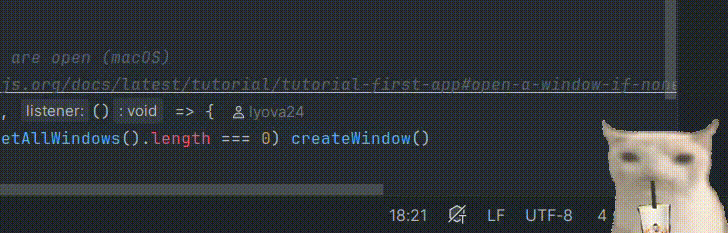

# boba-cat

##### fully vibe-coded cat enjoying some boba on your desktop



## usage (`.deb` example)
* download `.deb` from [releases](https://github.com/lyova24/boba-cat/releases) or build it yourself
  ```shell
  # build using this
  lzlobin@laptop:~$ npm run make
  
  # or this
  lzlobin@laptop:~$ electron-forge make
  ```
* install
  ```shell
  # path/to/deb depends on the prev step
  # it is in /out/make/deb/... if you built app yourself
  lzlobin@laptop:~$ dpkg -i path/to/deb
  ```
* check
  ```shell
  lzlobin@laptop:~$ which boba-cat 
  /usr/bin/boba-cat
  ```
* run
  ```shell
  lzlobin@laptop:~$ nohup boba-cat >/dev/null 2>&1 &
  ```

## controls
- left-click - hide the cat for a short period of time
- right-click - close the cat (quit an app)
