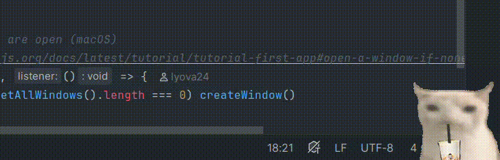

# boba-cat

A tiny cross-platform desktop cat enjoying some boba.



The app uses [Tauri 2](https://v2.tauri.app/) and the operating system's native
WebView instead of bundling Electron/Chromium. The UI is still plain HTML, CSS,
and JavaScript; the small native host is written in Rust.

## Supported platforms

- Linux (X11 or XWayland, which is used to preserve exact positioning and
  always-on-top behavior under Wayland compositors)
- Windows 10 and newer (WebView2)
- macOS 10.15 and newer (WKWebView)

## Development

Install the [Tauri prerequisites](https://v2.tauri.app/start/prerequisites/) for
your operating system. On Debian or Ubuntu, the active-window integration also
needs:

```shell
sudo apt-get install libwebkit2gtk-4.1-dev librsvg2-dev patchelf \
  libxcb-ewmh-dev libxcb-randr0-dev libdbus-1-dev pkg-config
```

Then run:

```shell
npm ci
npm start
```

## Build installers

```shell
npm run build
```

All application code and configuration lives under `src/`: `frontend/` contains
the HTML/CSS/JavaScript UI and `backend/` contains the Rust host.

Installers are written to `src/target/release/bundle/`. Tauri produces the
native formats supported by the build machine, such as `.deb`/`.AppImage` on
Linux, `.msi`/`.exe` on Windows, and `.app`/`.dmg` on macOS. GitHub Actions builds
all three desktop platforms and both x64/arm64 where configured.

Install a generated package (rather than copying the bare executable) to add
boba-cat and its icon to the operating system's application list.

## Controls

- Left click: hide the cat for a moment.
- Right click: hide the cat and quit the app.
- Drag: move the cat horizontally along the bottom edge. Its relative position
  is restored after restarting the app or changing display resolution.
- Tray menu: show or hide the cat, return it to the bottom-right corner, enable
  optional system autostart, or quit.

When a supported IDE is the active window, the cat switches to developer mode.
